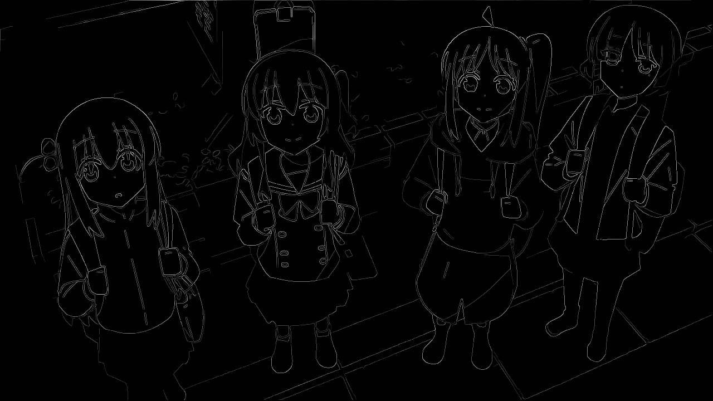

# Kinara Daryaft

Despicable implementation of a Canny Edge Detector in C++.




## Usage

#### Binary

```bash
git clone https://github.com/masroof-maindak/kinara-daryaft.git
cd kinara-daryaft
mkdir build && cd build
cmake -DCMAKE_BUILD_TYPE=Release .. # Or 'Debug' if you want to hack away.
cmake --build .
./knr -i <input-image> -o <output-dir>
```

#### Library

```cmake
# CMakeLists.txt

FetchContent_Declare(
    KinaraDaryaft
    GIT_REPOSITORY https://github.com/masroof-maindak/kinara-daryaft.git
    GIT_TAG origin/main
)

FetchContent_MakeAvailable(KinaraDaryaft)

target_link_libraries(your_executable PRIVATE KinaraDaryaft)
```

```cpp
// main.cpp

#include <knr/canny.h>

/*
 * std::expected<cv::Mat, std::string> canny_edge_detector(const std::string &img_name, const cv::Mat &img,
 *                                                         const CannyCfg &args, bool save_intermediates);
 */
```

## Dependencies

- OpenCV
- QT6
- VTK
- HDF5

#### Arch Linux

```bash
sudo pacman -S opencv qt6-base vtk hdf5
```

## Acknowledgements

- Fundamentals of Computer Vision - Mubarak Shah
- [ArgParse](https://github.com/p-ranav/argparse)
